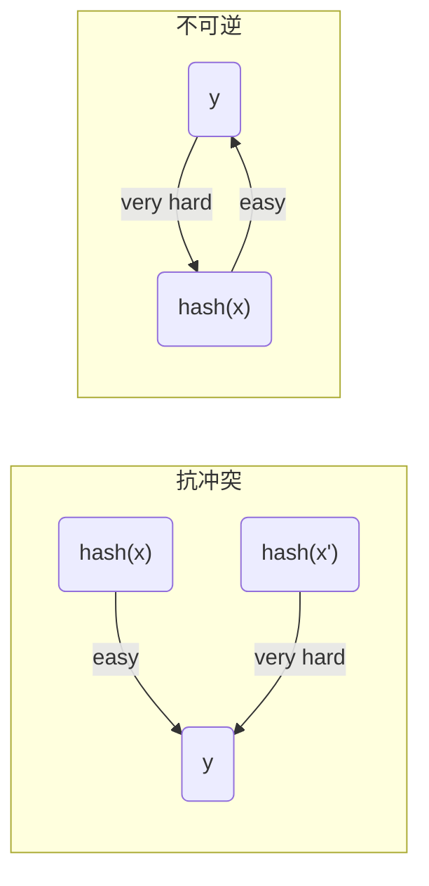

# 哈希函数

哈希函数将文本或二进制数据转换为固定长度的散列值，并且要具有抗冲突性和不可逆性。
- 抗冲突
  - 意味着输入不同，hash函数的输出不同。或者说很难找的两个输入，他们的hash值是一样的。
- 不可逆
  - 计算hash值很容易，但是根据hash值推断出hash函数的输入很难，其概率是可忽略的。
<!-- more -->

## 常用的哈希算法
现在密码学是不断发展的，没有绝对安全的哈希算法。过去有些常用的哈希算法已经被证明不安全的(MD5、SHA0、SHA1),有些现在仍然被认为是安全的，比如SHA-2，SHA-3和BLAKE2。但这并不意味着以后这些算法依然安全。
### 目前安全的哈希算法
- SHA-2, SHA-256, SHA-512
- SHA-3, SHA3-256, SHA3-512, Keccak-256
- BLAKE2, BLAKE2s , BLAKE2b

## 哈希函数的用途

1. 验证数据完整性
   对文件计算hash可验证文件的内容是否被篡改。
2. 保护密码
   保存密码的hash值，而不保存密码的明文。这样攻击者拿到密码的hash也无法得到密码。
3. 生成唯一id
   由于hash函数是抗冲突的，可用hash函数对文件/数据计算hash值，并将这个值作为文件/数据的唯一id。
4. pow算法
   hash函数是不可逆的，想要构造一个值，使得它的hash值满足特定的要求是很困难的。需要不停的尝试和计算，还需要一些运气。pow算法要求矿工不断的尝试nonce，使得hash(nonce+x)的值满足前64(该值可动态调整)个bit为0。
5. 计算伪随机数生成器
   

