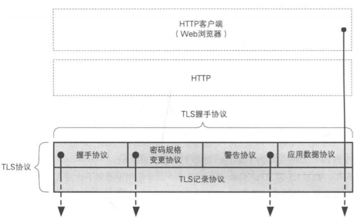
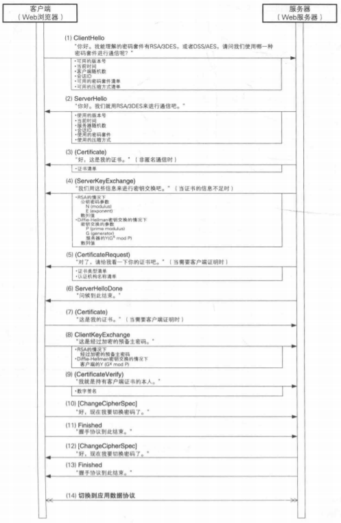
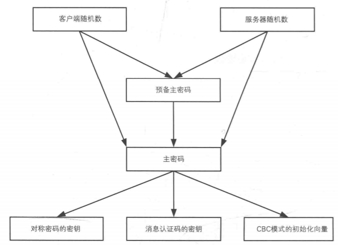
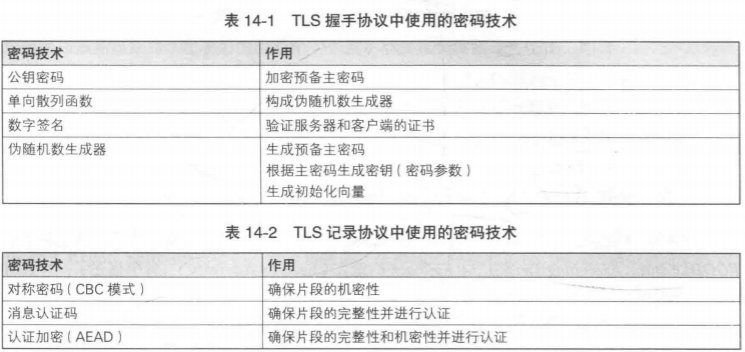

# 传输层安全TLS

## 目的
为了实现客户端和web服务器之间的安全通信，解决HTTP等协议的安全问题。主要是一下三个方面：
1. **机密性：**，客户端和服务器之间的通信不能被窃听。
2. **完整性：**，客户端和服务器之间的通信内容不能被篡改。
3. **可认证：**，确认web服务器是真正的需要通信的对方。
机密性可利用加密来确保，完整性可利用MAC来确保，可认证可利用数组签名生成的整数来保证。

## TLS协议
TLS协议是一个层次化的协议,由TLS记录协议和TLS握手协议两层协议叠加而成。TLS记录协议负责进行加密，TLS握手协议负责除了加密以外的其他操作。

### TLS记录协议
- 负责消息的分割与压缩。
- 负责使用对称加密来对消息进行加解密。
- 负责用消息认证码（MAC）来对认证消息。

### TLS握手协议
TLS握手协议包含4个子协议：握手协议、密码规格变更协议、警告协议和应用数据协议。
- **握手协议：**负责再客户端和服务器之间协商密码算法和共享密钥，以及认证整数。
- **密码规格变更协议：**负责向通信对象传达变更密码方式的信号。
- **警告协议：**负责在发生错误时把错误传达给对方。
- **应用数据协议：**将TLS上层的应用数据传达给通信对象。

#### 握手协议
握手协议流程如下所示：

1. ClientHello (客户端-->服务端)
   - 客户端告知可用的加密算法、压缩算法、客户端随机数等信息
2. SeverHello (客户端<--服务端)
   - 服务端根据clientHello消息选择响应的加密算法、压缩算法等信息，以及服务端的随机数。
3. Certificate (客户端<--服务器)
   - 服务端将自己的证书发送给客户端，客户端对证书进行验证。
4. SeverKeyExchange (客户端<--服务器)
   - 向客户端发送必要的密钥信息
5. ServerHelloDone (客户端<--服务器)
6. ClientExchange (客户端-->服务器)
   - 向服务端发送经过加密的预备主密码（一个随机数，用于生成主密码的种子）
   - 客户端和服务端生成相同的主密码，并利用主密码生成对称密码的密钥、消息认证码的密钥。
   - 
7. Finished (客户端-->服务端)
8. 切换应用数据协议，进行加密通信。

## 攻击
1. 对TLS中使用的任何一个密码技术的攻击，都构成对TLS的攻击。
2. 攻击伪随机数生成器。
3. 利用证书的时间差进行攻击。

## 小结

