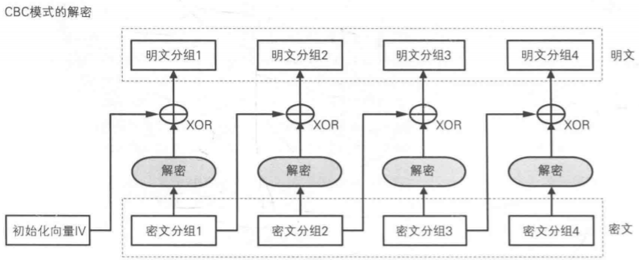
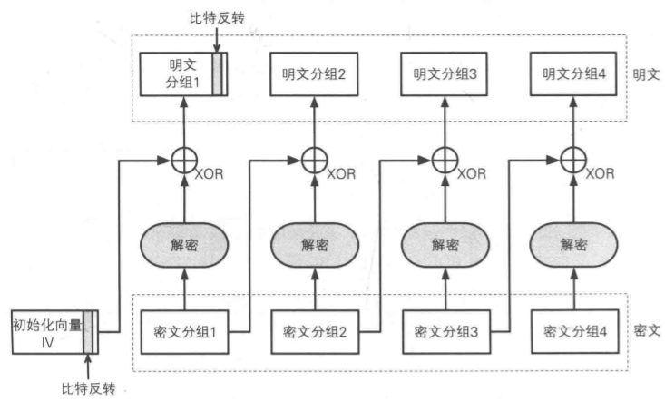
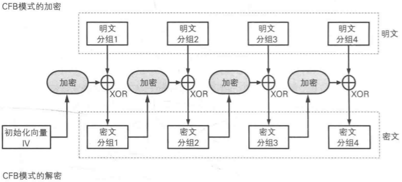
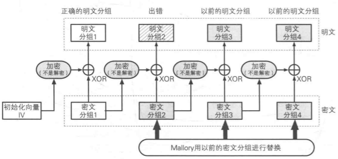
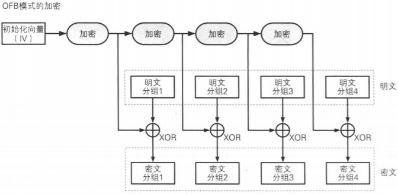
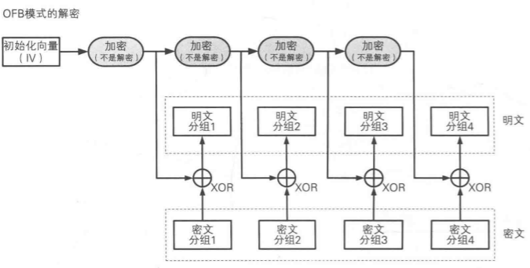
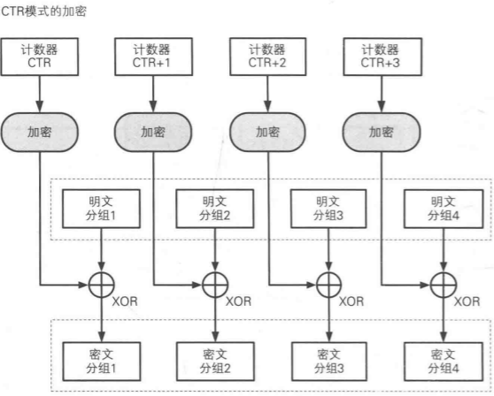
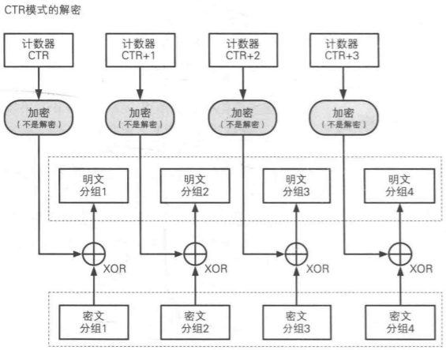
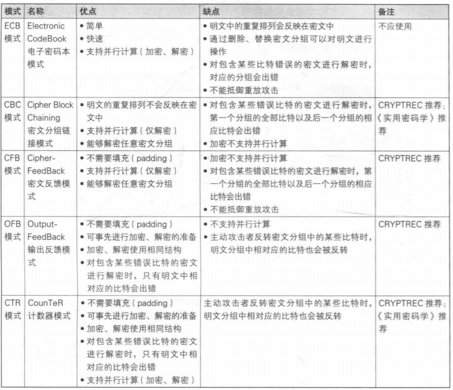

# 分组密码

- ECB模式：electronic codebook mode 电子密码本模式
- CBC模式：cipher block chaining mode 分组链接模式
- CFB模式：cipher feedback mode 密文反馈模式
- OFB模式：output feedback mode 输出反馈模式
- CTR模式：counter mode 计数器模式

## ECB模式

明文分组加密后直接输出为密文分组。

#### ECB模式的攻击：

1. 明文分组相同-->密文分组相同，这样明文的分布特征容易被推测。
2. 如果改变了密文分组的顺序，那么相应的明文分组顺序就会改变。这样攻击者就可以直接操控明文。

## CBC模式

CBC模式中，明文分组和前一个密文分组**异或**后，然后再进行加密。其中IV是初始化向量，每次加密随机产生。

### **CBC模式的攻击**：

**攻击初始向量IV**

- 将IV的任意bit翻转都会导致相应的明文分组的比特翻转。
- 如果翻转密文分组i的话，都会导致解密后的明文分组k（k>=i)的发生不可控的变化。

**填充提示攻击（padding Oracle attack）**

- 明文不为分组长度整数倍时，需要再最后一个分组中填充数据来凑满。
- 攻击者反复尝试发送密文和不同的填充数据。接受者无法解密后会返回错误信息。
- 攻击者利用错误信息可以获得一部分和明文相关的信息。

## CFB模式
CFB模式中，前一个密文会被送回到密码算法的输入端。

### CFB模式的攻击
**重放攻击**
攻击者可利用历史的密文分组将历史的明文插入到解密的明文中。

## OFB模式
OFB模式将密码算法的输出反馈到密码算法的输入中。

## CTR模式
利用逐次累加的计数器来加密生成密钥流的流密码。

## 各个模式的对比

