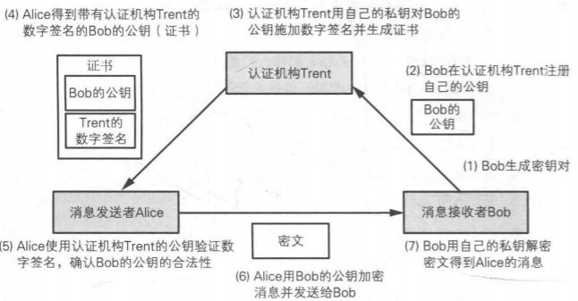
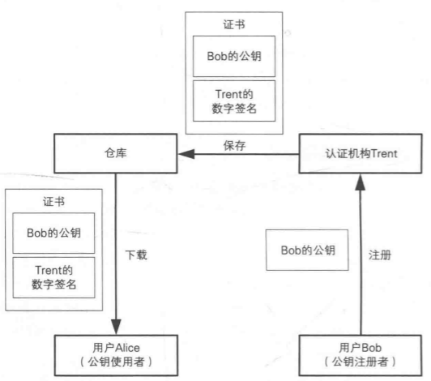

# 证书
证书包含姓名、组织、邮箱地址等个人信息，以及属于此人的公钥。证书由认证机构（CA）颁发。

## 证书的使用
证书的使用示例如下图所示：

1. bob生成密钥对，私钥妥善保存
2. bob在ca注册自己的公钥
3. ca用自己的私钥给bob的公钥添加签名并生成数组签名
4. Alice得到ca的签名过的bob的公钥
5. alice用ca的公钥验证签名，确认bob公钥的合法性
6. alice用bob的公钥加密消息并发送给bob
7. bob用私钥解密alice的消息

## 证书的标准
常见的证书标准是格式

## 公钥基础设施(PKI)
PKI是为了能有效利用公钥而制定的一系列规范和规格的总称。
### PKI组成要素
- **用户**：使用PKI的人
  - 注册公钥的用户
  - 使用已注册公钥的用户
- **认证机构**：管理证书的机构
  - 生成密钥对(可选，可由用户生成)
  - 注册公钥是对用户身份进行认证
  - 生成并颁发证书
  - 作废证书
- **仓库**：保存证书的机构
  - 保存证书的数据库

## 攻击

### 公钥注册前攻击
攻击者alice在受害者bob注册公钥前偷偷将公钥换成自己的，那么证书就将bob信息和alice的公钥绑定在一起。
**防御办法**：用ca的公钥对bob的公钥加密，同时ca确认身份时可以将bob公钥的hash一并发送。

### 注册相似的人名
攻击者注册相似的人名以及个人信息的证书，这种情况下人类是很容易认错的。
**防御办法**：CA确认身份时需要严格核准，确认失败不办法证书。

### 窃取CA的私钥
攻击者窃取了CA的私钥，那么变可以以CA的身份来颁发任何证书了。
**防御办法**：CA发现私钥被窃取后，需要将私钥泄露一事通过CRL通知用户。

### 伪装CA进行攻击
攻击者自己成立一个CA，然后给用户颁发证书。
**防御办法**：用户应该确认CA是否可信。

### 利用CRL
公钥失效到收到CRL更新是需要一段时间的，攻击者可利用这个时间差来攻击。
**防御办法**：公钥失效尽早通知CA；CA尽快发布CRL；用户及时更新CRL。

