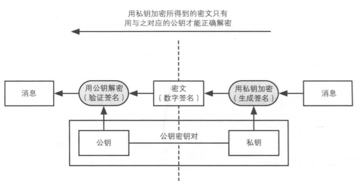
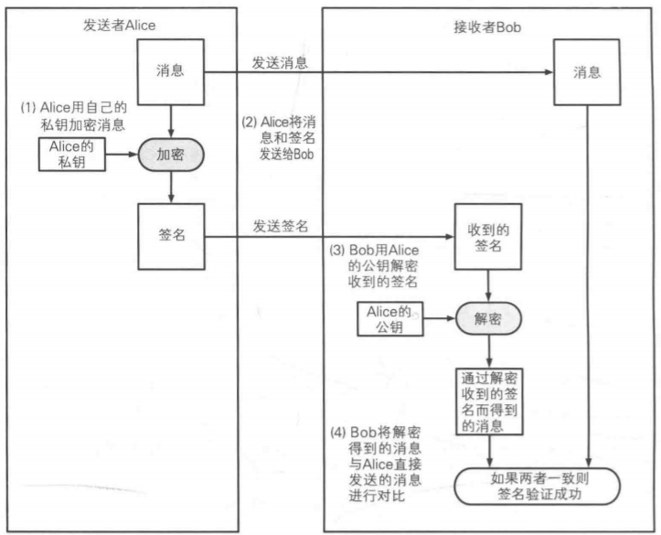
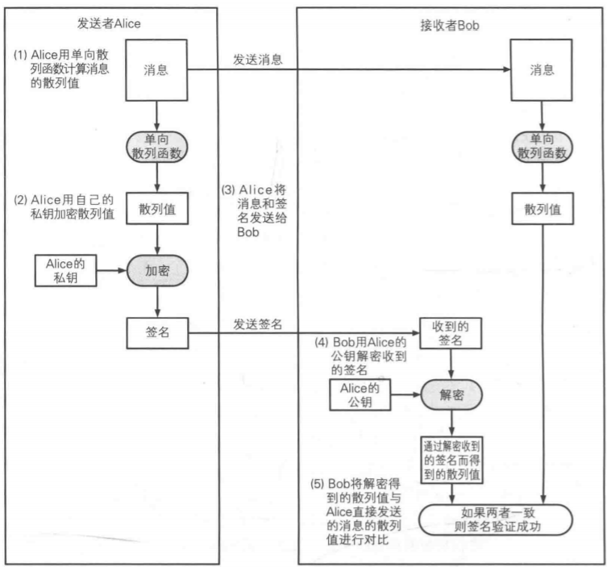
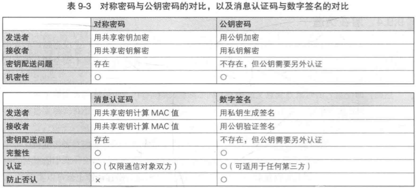

# 数字签名

数字签名可以识别篡改和伪装，还可以**防止否认**。消息认证码（MAC）实际上也可以识别消息的完整性，但是他无法做到**防止否认**。

## 公钥密码与数字签名
数字签名是基于公钥密码来实现的，与公钥加密不同的是，数字签名使用私钥来加密（签名），使用公钥来解密（验签）。


## 数字签名的方法
有两种办法生成数字签名，一种是直接对消息签名，一种是直接对消息的散列值签名。
### 对消息签名
1. 发送者用私钥加密消息，生成签名。
2. 发送者将签名和消息发送给接收者。
3. 接收者用发送者的公钥对签名进行解密。
4. 接受者比较签名解密的结果和消息进行对，相同则验证成功，不同则验证失败。


### 对消息的散列值签名
当消息的长度十分长时，加之公钥密码本身就慢，此时如果直接对消息加密时非常耗时的。借助hash函数我们可以将需要加密的内容缩减为固定的散列值，这样可以提高加密的效率。
1. 发送者计算消息的hash值。
2. 发送者用私钥对hash值进行加密，生成签名。
3. 发送者将消息和签名发送给接收者。
4. 接受者用发送者的公钥对签名进行解密。
5. 接收者比较解密后的hash和消息的hash值，相同则验证成功，不同则验证失败。


## 算法
1. RSA加hash函数
2. ECDSA：椭圆曲线密码签名算法
3. Rabin

## 攻击
1. 中间人攻击
   攻击者在发送者和接收者中间，对发送者伪装成接收者，对接收者伪装成发送者。**防止中间人攻击**需要对公钥进行认证，确保自己得到的公钥是属于自己的通信对象。
2. 攻击hash函数
3. 利用数字签名攻击公钥密码
   RSA中生成签名等同于解密消息
   ```
   签名 = 消息^D mod N; 明文 = 密文^D mod N；
   ```
   如果攻击者将公钥加密后的**密文**发送给私钥的持有者，并以某种方式请求对方对**该密文**进行**签名**，那么签名的结果就是解密后的**明文**。
   为了**防范此类攻击**，首先不要对消息进行签名，要对hash值签名；其次需要将公钥密码和数字签名的密钥对分离开来；不要对不可靠的消息进行签名。

## 应用
1. 信息公告
2. 软件下载
3. 公钥证书

## Q&A

1. **数字签名和手写签名的区别？**
   1. 手写签名是固定的，根签名人有关，跟消息无关。
   2. 数字签名不是固定的，随着消息的改变而改变。
2. **数字签名能替代纸质签名吗？**
   1. 软件的可信性是一个问题，如果软件不可信，那么签名的内容是无法保证的。
   2. 相关法律有待完善，社会认知有待进步。
3. **如何防止否认?**
   1. 消息认证码中，发送者和接受者均能生成相同的mac值。
   2. 数字签名中，只有发送者能生成签名。

## 对比
