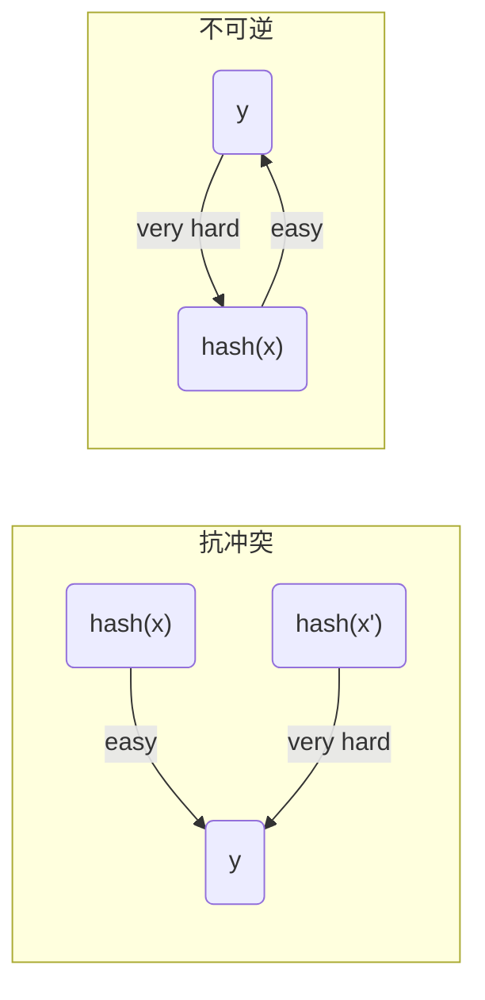

# 哈希函数

哈希函数将文本或二进制数据转换为固定长度的散列值，并且要具有抗冲突性和不可逆性。
- 抗冲突
  - 意味着输入不同，hash函数的输出不同。或者说很难找的两个输入，他们的hash值是一样的。
- 不可逆
  - 计算hash值很容易，但是根据hash值推断出hash函数的输入很难，其概率是可忽略的。
<!-- more -->

## 常用的hash算法
现在密码学是不断发展的，没有绝对安全的哈希算法。过去有些常用的哈希算法已经被证明不安全的(MD4、MD5、SHA0、SHA1),有些现在仍然被认为是安全的，比如SHA-2，SHA-3和BLAKE2。但这并不意味着以后这些算法依然安全。
### 目前安全的hash算法
- SHA-2, SHA-256, SHA-512
- SHA-3, SHA3-256, SHA3-512, Keccak-256
- BLAKE2, BLAKE2s , BLAKE2b
## 对hash函数的攻击

### 暴力破解
不断逐一尝试，对于512bit的散列值而言，需要计算2^512次。

### 生日攻击
**生日问题:**N个人中，至少有两个人生日一样的概率大于1/2，问N至少为多少？
**解答：**
- 考虑N个人生日互不相同的概率：p(N) = (365 x 364 x ... x (365-N+1))/365^N;
- 那么N个中至少两个人生日一样的概率为 1-p(N)>1/2;
- 计算可得N为23时，两个人生日一样的概率为0.507>0.5

**推广：**假设一年天数为Y,能使得N个人中生日相同的概率大于1/2,那么所需最小的N是多少？
**结论：**当N非常大时，近似结果为N=sqrt(Y),根号Y。

根据此结论我们可以知道，对于512bit的散列值而言，只需计算2^(512/2) = 2^256次，就有很高的概率破解。相比暴力破解法，还是进不了许多。

## hash函数的用途

1. **验证数据完整性**
   对文件/软件计算hash可验证文件的内容是否被篡改。
2. **保护密码**
   保存密码的hash值，而不保存密码的明文。这样攻击者拿到密码的hash也无法得到密码。
3. **基于口令的加密**
   将口令和盐混合后计算hash值，然后将hash值作为加密的密钥。这样可以防御针对口令的攻击。
4. **生成唯一id**
   由于hash函数是抗冲突的，可用hash函数对文件/数据计算hash值，并将这个值作为文件/数据的唯一id。
5. **pow算法**
   hash函数是不可逆的，想要构造一个值，使得它的hash值满足特定的要求是很困难的。需要不停的尝试和计算，还需要一些运气。pow算法要求矿工不断的尝试nonce，使得hash(nonce+x)的值满足前64(该值可动态调整)个bit为0。
6. **数字签名**
7. **消息认证码**
8. **计算伪随机数生成器**
   

