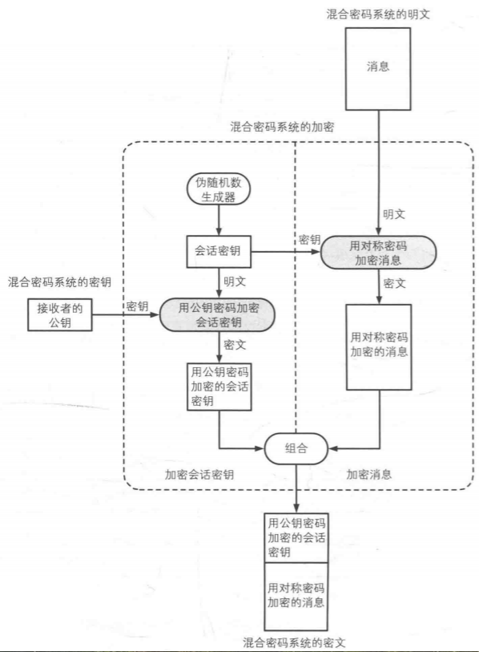
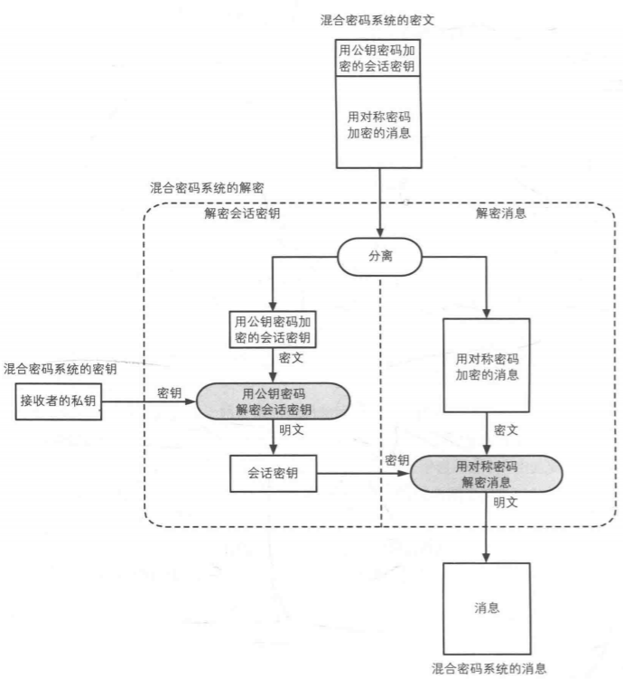

# 混合密码系统

对称密码存在密钥配送难得问题，而公钥加密存在性能低效得问题。混合密码系统是将对称密码和公钥密码相结合，做到了取长补短。混合密码系统得组成机制如下：
1. 用**对称密码**来加密消息
2. 用**伪随机数生成器**生成对称密码中得使用的会话密钥
3. 用**公钥密码**加密会话密钥
4. 从混合密码系统外部赋予公钥密码加密时用的密钥
<!-- more -->
**什么是好的混合密码系统？**
1. 足够好的伪随机数生成器
2. 高强度的对称密码算法以及足够长的密钥
3. 高强度的公钥密码算法以及足够长的密钥
一般情况中，公钥密码长度要更长，因为每次通信对称密钥都是临时的，而公钥密码是得一直用的。
## 加密
混合密码系统的加密如下图所示：

**需要注意：会话密钥**是临时密钥，每次通信都会用伪随机数生成器随机生成。

## 解密
混合密码系统的解密如下图所示：

## 应用
密码软件PGP，https中的SSL/TLS中均使用的是混合加密系统。

### SSL/TLS

### PGP

