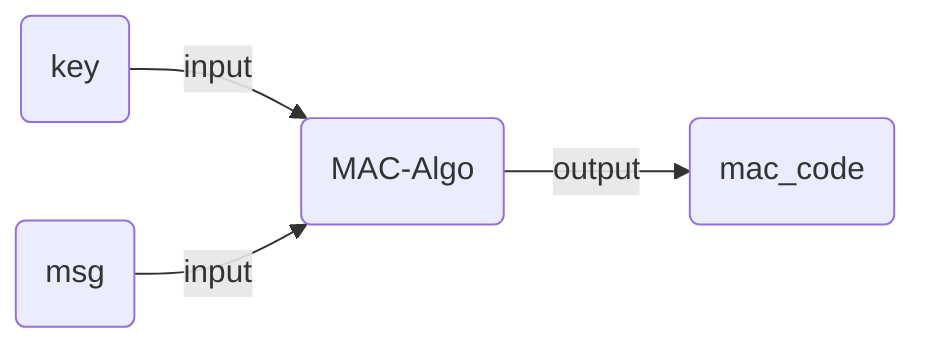
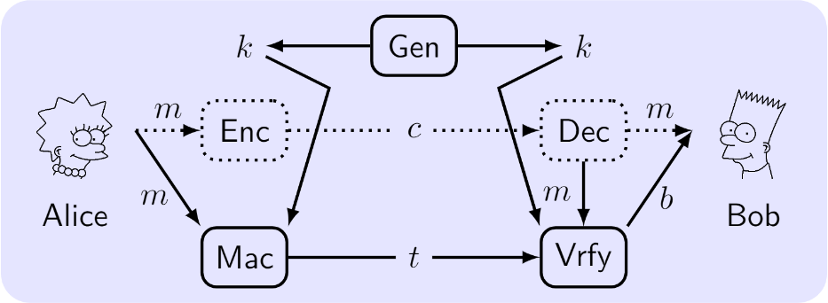

# 消息认证码 (MAC)
消息认证码是将key和消息msg混合后输出一个用于认证的auth_code。

## MAC为什么能做认证?

- 双方以某种方式交换某个秘密MAC密钥(**预共享密钥**)。

- 我们收到来自某处的message + auth_code(例如，从互联网，从区块链，或电子邮件消息)。

- 我们希望确保message没有被篡改，这意味着key和message都是正确的，并匹配MAC。

- 如果有篡改的消息，MAC将是不正确的。
- 实际场景下message在channel中通常是加密的，这种情形下可以用MAC来认证加密消息。
- 

## 常见的MAC算法

- 基于hash的MAC算法
  - HMAC (Hash-based MAC, e.g. HMAC-SHA256)
  - KMAC (Keccak-based MAC)
- 基于对称加密的MAC算法
  - CMAC (Cipher-based MAC)
  - GMAC (Galois MAC)
  - Poly1305 (Bernstein's one-time authenticator)
- 其他
  - UMAC (based on universal hashing)-
  - VMAC (high-performance block cipher-based MAC)
  - SipHash (simple, fast, secure MAC)

## HMAC原理

hmac是一种常见的mac算法，其构造的原理如图所示：

其中：

- **IV**：随机生成的向量
- **k**: 就是mac算法需要的key
- **ipad**：0x5C的填充
- **opad**: 0x36的填充
- **m**: message被分割成的若干端
- **t**：最后的输出