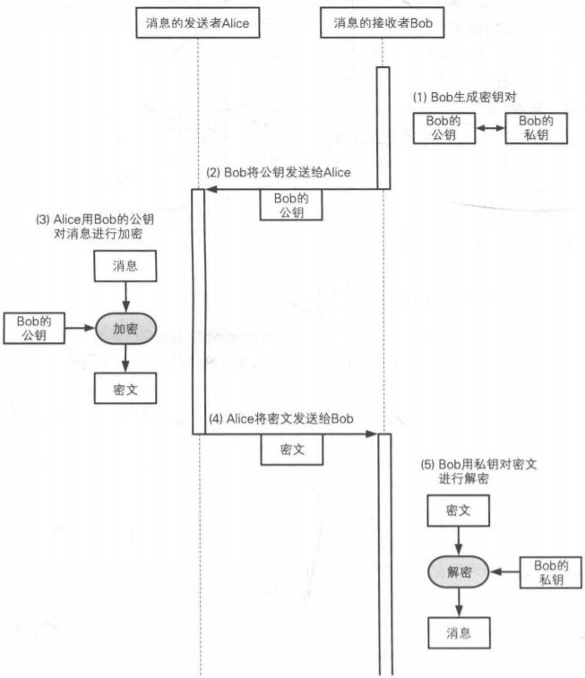
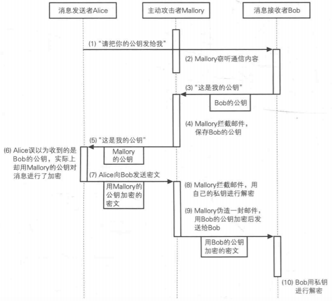

# 公钥密码学
公钥密码和对称密码的主要区别是：对称密码中只有一个密钥，发送者用对称密钥加密，接收者用私钥解密；公钥密码中有两个密钥:一个是公钥，另一个是私钥，发送者用公钥加密，接收者用私钥解密。
<!-- more -->
## 公钥通信的流程
1. bob生成密钥对（公钥和私钥）,私钥妥善保存。
2. bob将自己的公钥发送给Alice。
3. Alice用bob的公钥对要发送的消息进行加密。加密的消息必须得用bob的私钥才能解密。
4. Alice将密文发送给bob。
5. bob收到密文后用自己的私钥解密。


## 常见的公钥算法

### RSA

#### 密钥生成

1. 计算N
   找的两个大质数p和q,令N=p * q;
   
2. 计算N的欧拉函数值L

   L = (p-1)*(q-1);

3. 计算E

   取一个E，使得E和L最大公因数是1，即gcd(E, L) = 1;

4. 计算D

   求D，满足1<D<L，且E*D mod L = 1;

5. **公钥：**（E，N)；**私钥：**（D，N）

#### 加密

```
密文 = 明文 ^ E mod N
```

也就是将明文求E次方，然后再mod N的结果。

#### 解密

```
明文 = 密文^D mod N
```

将密文求D次方，然后再mod N的结果。

#### 攻击

1. **暴力破解法**：逐个尝试D的可能值来破译，难度随着密钥的长度增加而指数增加。现在rsa中D的长度一般再2048位左右，所以暴力破解的难度是极高的。

2. **质因子分解攻击：**对N进行质因子分解攻击，尝试将N分解为两个质数p和q，这样便可以计算出D。但是目前并没有对大整数进行质因子分解的高效算法，因此这种办法也是十分困难的。

3. **猜测p和q：**p和q是通过伪随机数生成器产生的，由于伪随机的算法很差，那么攻击者就有可能猜测出p和q。

4. **中间人攻击：**并不是尝试破解RSA算法，但是是针对机密性的有效攻击。攻击步骤如下：

   

   针对此类攻击的防范需要证书和PKI体系来对公钥进行认证。

5. **选择密文攻击：**攻击者选择密文让接收者解密，攻击利用接收者返回的信息能够获得明文中的少量信息。为了抵御此类攻击，需要再解密时能够判断“**密文是否由知道明文的人通过合法的方式产生的**”。**RSA-OAEP**（Optimal　Asymmetric　Encryption　Padding）就是RSA的改良版。RSA-OAEP会在明文前填充一些认证信息，保留明文hash值和一定数量的0，然后再对填充的明文进行加密。解密时，如果没有找的正确的认证信息，就返回“decryption error"，注意这里不能将具体的错误信息返回。


### EIGamal方式
EIGamal方式利用mod N下求离散对数的是困难的。加密后的密文是明文的两倍。

### Rabin方式
Rabin方式利用mod N下求平方根的困难。

### 椭圆曲线密码（Elliptic Curue Cryptographic，ECC)
椭圆曲线密码利用椭圆曲线上特定点进行特殊的乘法运算来实现，这种运算的逆运算是非常困难的。椭圆曲线的密钥长度比RSA的短。