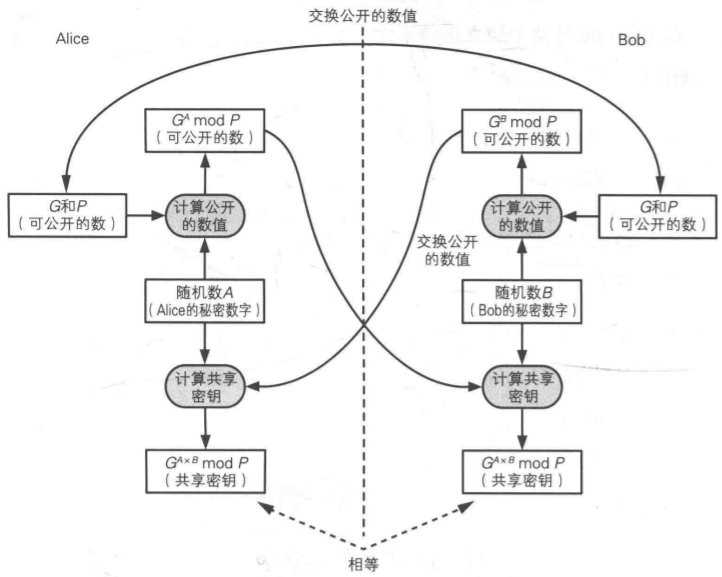

# 密钥

## 密钥的种类
1. 按算法划分
   - 对称密码的密钥
   - 公钥密码的密钥
2. 按功能划分
   - 加密密钥
     - 对称密码
     - 公钥/私钥
   - 认证密钥
     - 消息认证码的密钥
     - 数字签名的密钥
3. 按使用次数划分
   - 会话密钥（只用一次）
   - 主密钥（一直重复使用）
4. 按用途划分
   - 加密**消息内容**的密钥
   - 加密**密钥**的密钥

## 密钥的管理

- 生成密钥
  1. 伪随机数生成密钥
  2. 基于口令生成密钥：口令（password)加盐（salt)再hash得到密钥
- 配送密钥
  1. 事先共享
  2. 密钥分配中心
  3. 公钥密码
  4. DH密钥交换
- 更新密钥
  1. 将当前密钥的散列值作为下一个密钥
- 保存密钥
  1. 以文件形式保存，并用专门的加密密钥加密密钥文件。
- 作废密钥
## DH密钥交换
通过DH密钥交换，通信双方可以交换一些可以公开的信息就能生成共享的秘密数字，这个秘密数字可以被用作对称密码的密钥。DH密钥交换步骤如下：

1. Alice向bob发送两个质数P，G,P是大质数，G是生成元
2. Alice生成一个随机数A，A在区间[1,p-2]
3. Bob生成一个随机数B，B在区间[1,p-2]
4. alice将G^A mod P 发送给bob
5. bob将G^B mod P 发送给alice
6. alice计算bob发来的数的A次方并mod P,即G^(A*B) mod P
7. bob计算alice发来的数的B次方并mod P,即G^(A*B) mod P
8. 这样alice和bob都有同样的密钥了。

**生成员G的选取**：G必须满足G的1,2,...,P-1次方 mod P的结果和1~P-1中的数字一一对应。

## 基于口令的密码（PBE）

